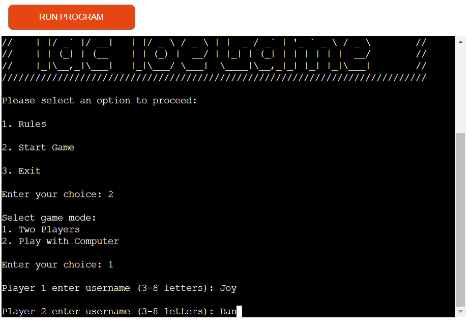

# Ultimate xo 

## A Tic Tac Toe Game

.

> This is a python tic-tac-toe game which is played between two people, a player can choose to player with another player or play with the computer. One player plays 'X' and the other player plays 'O', the players take turns in placing their marks on a grid of four by four cells. If a player gets four marks in a row horizontally, vertically, or diagonally, the player wins the game.

### **[Live link](https://ultimate-xo-4e6620460ba8.herokuapp.com/)**

# Flowchart

To create the process of this project i used 
[Lucid chart](https://lucid.app/documents#/templates?folder_id=home).

Below is the flowchart of this project, it shows the entire design and concept of the program.

## Data Model 
- The game board represents the game board with methods to manipulate and display it.
- Player represents a player with attributes such as username and mark (X or O).
- Game represents the entire game, managing players, game state, and game logic.

## Features

### Existing Features

### **User Flow**

- **Welcome Message**
    - Upon running the application the user is greeted with a welcome message, and options to select from.
    - I used [ASCII Art](https://www.asciiart.eu/) to create the welcome message.

- **Rules**
    - When the user selects option 1 the rules appears.

- If the user selects a number outside 1, 2, or 3 it returns an invalid message with the opportunity to pick again.

- **Start Game**

    ***Game mode***
    - When the user selects option 2, the game mode appears for the user to either select 2 players or play with the computer.

- When the first option is selected, which is 2 players, it prompts entering of username for player 1 and player 2.
- When the second option is selected, which is play with computer, the user is asked to enter a username.

- Username validation

- Display the board to begin the game

- Input validation and error checking.
    - User must enter numbers between 1 to 16.
    - User must enter only numbers.

- User can not select already occupied cell.

- When game ends the winner is displayed with the option to play again or exit the game.

- Select yes to replay
- Select no to exit

## Future Features
- Make the computer a more challenging opponent. 
- Make the game more difficult with different levels like (Easy, Medium, Hard) with computer opponent.
- Add different Board Sizes and allow users to choose different board sizes.
- Add a timed mode where players have a limited amount of time to make their move.
- Track and display the history of games played, including wins, losses, and draws.

## Tools & Technologies Used

-  used for version control. (`git add`, `git commit`, `git push`)
-  used for secure online code storage.
-  used as a cloud-based IDE for development.
- ) Used to create the application.
-  used to generate README/TESTING templates.
-  Used to deploy and host the application.

## Libraries
- os - Miscellaneous operating system interfaces
- Random

## Testing

#### Manual Testing

| Test | Result |
|--|--|
|When the programme runs, the welcome message appears| Works as expected |
|The options to select from apears after the welcome message|Works as expected|
|Option 1 displays the rules| Works as expected|
|Option 2 displays the game mode with two options to select from|Works as expected|
|Option 3 ends the game and a goodbye message is displayed|Works as expected|
|First option from the game mode display two players|Works as expected|
|Second option from game mode is the option to play with computer|Works as expected|
|Ask for username when option 1 or 2 is selected|Works as expected|
|Check for valid/invalid username|Works as expected|
|Numbers entered must be between 1 to 16|Works as expected|
|Occupied cells can not be slected|Works as expected|
|The winner is announced when the game ends|Works as expected|
|Options to replay or exit is given when the game ends|Works as expected|

## Code Validation

### Pep8 Validator

I have used the recommended [Pep8 Validator](https://pep8ci.herokuapp.com/) to validate my code.

| File | screenshot | Notes |
| --- | --- | --- |
| Run.py |  | Pass: No Errors |

## Bugs

- I got syntaxwarning invalid escape sequence '\' when i added the Ascii art welcome message i created. this warning occured because backslashes are interpreted as escape characters in python strings.

   - To fix this i used raw strings by prefixing the 'r' to prevent backslashe from being treated as escape characters.

- During my code validation process i encounter alot of errors due to blank lines and long characters

 

  - To fix this, i split the lines into mutiple lines to fit in within the 79-character limit, and increase the blank lines to 2 instead of 1 when needed.

## Remaining Bugs
- No bugs remaining

## Deployment

Code Institute has provided a [template](https://github.com/Code-Institute-Org/python-essentials-template) to display the terminal view of this backend application in a modern web browser.
This is to improve the accessibility of the project to others.

### Heroku Deployment

This project uses [Heroku](https://www.heroku.com) for deployment.

Deployment steps are as follows, after account setup:

- Create a new Heroku app
- Select **New** in the top-right corner of your Heroku Dashboard, and select **Create new app** from the dropdown menu.
- Your app name must be unique, and then choose a region closest to you (EU or USA), and finally, select **Create App**.
- From the new app **Settings**, click **Reveal Config Vars**, and set the value of KEY to `PORT`, and the value to `8000` then select *add*. 
- If using any confidential credentials, such as CREDS.JSON, then these should be pasted in the Config Variables as well.
- Set the buildbacks to Python and Node.js in that order.
- Click on Deploy.
- Link the Heroku app to the repository
- To connect with github, select github and confirm.
- Search for your repository select it and click connect
- Link the Heroku app to the repository
- You can choose to either deploy using automatic deploys which means heroku will rebuild the app everytime you push your changes.
- For this option choose the branch to deploy and click enable automatic deploys.
- This can be changed at a later date to manual.
- Manual deployment deploys the current state of a branch.
- Click deploy branch.
- We can now click on view to view our application.

### Local Deployment

This project can be cloned or forked in order to make a local copy on your own system.

#### Cloning

You can clone the repository by following these steps:

1. Go to the [GitHub repository](https://github.com/jojoakh/ultimate-xo) 
2. Locate the Code button above the list of files and click it 
3. Select if you prefer to clone using HTTPS, SSH, or GitHub CLI and click the copy button to copy the URL to your clipboard
4. Open Git Bash or Terminal
5. Change the current working directory to the one where you want the cloned directory
6. In your IDE Terminal, type the following command to clone my repository:
	- `git clone https://github.com/jojoakh/ultimate-xo.git`
7. Press Enter to create your local clone.

Alternatively, if using Gitpod, you can create your own workspace using this repository.

#### Forking

By forking the GitHub Repository, we make a copy of the original repository on our GitHub account to view and/or make changes without affecting the original owner's repository.
You can fork this repository by using the following steps:

1. Log in to GitHub and locate the [GitHub Repository](https://github.com/jojoakh/ultimate-xo)
2. At the top of the Repository (not top of page) just above the "Settings" Button on the menu, locate the "Fork" Button.
3. Once clicked, you should now have a copy of the original repository in your own GitHub account!

## Credits

### Content

| Source | Location | Notes |
| --- | --- | --- |
| [Code Coach](https://www.youtube.com/watch?v=dK6gJw4-NCo) | For inspiration |The video helped me to understand some concepts |
| [ASCII Art](https://www.asciiart.eu/) | Welcome message | Used to create welcome message |
| [Lucid app](https://lucid.app/documents#/documents?folder_id=recent) | Readme | used to create flowchart |
| [Code institute](https://learn.codeinstitute.net/) | Entire project | implemented everything i have learnt so far in this project |

### Acknowledgement

- I would like to say a big thank you to my mentor, [Alan Bushell](https://github.com/Alan-Bushell) for his support and feedbacks throughout the development of this project.
- I would like to thank my lovely husband for being there all the time i needed his help and for supporting me to take this step into software development.

